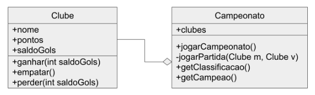

# Programação Orientada a Objetos 2024.1
##  Miniprojeto
Desenvolvido por <strong>Guilherme Viana Batista</strong>.  
O projeto trata-se de um projeto utilizando dos conceitos iniciais de POO e Java como método de avaliação para a cadeira de Programação Orientada a Objetos 2024.1 da UFCA (Universidade Federal do Cariri).

## Especificação:
Vamos desenvolver um programa em Java para simular um campeonato de futebol. Nosso campeonato terá as seguintes regras:
- Todos os clubes se enfrentam entre si em jogos de ida e volta;
- Uma vitória vale 3 pontos, um empate vale 1 ponto e uma derrota não pontua;
- Ao final do campeonato, o clube com maior pontuação é o campeão;
- Em caso de empate no número de pontos, o saldo de gols deverá ser o critério de desempate;
- O saldo de gols é a diferença entre gols feitos e gols sofridos em todo o campeonato.
Para implementação do campeonato deveremos ter as seguintes classes:

A classe Clube tem como atributos seu nome, seu número de pontos e seu saldo de gols. Os métodos ganhar, empatar e perder devem incrementar os pontos e o saldo de gols de acordo com as regras do campeonato.
A classe Campeonato possui como atributo uma coleção de clubes. Você pode implementar essa coleção do jeito que quiser (vetor, arraylist, etc). Nessa classe também temos o método jogarCampeonato que deverá fazer um arranjo da coleção de clubes 2 a 2, de forma que cada clube jogue com todos os outros clubes do campeonato em um jogo de ida e um jogo de volta. Para cada partida, o método jogarCampeonato deverá chamar seu método auxiliar jogarPartida, que irá sortear um placar como sendo dois inteiros entre 0 e 5 representando a quantidade de gols que cada time marcou. Após esse sorteio, o método verifica o resultado, chamando os respectivos métodos para ganhar, empatar e perder dos dois clubes. Ao final da execução do campeonato, os métodos getClassificacao e getCampeao deverão ser chamados. O getClassificacao vai ordenar a coleção de clubes pela pontuação, utilizando o saldo de gols para desempate e retorna uma String que pode ser impressa na tela. Por fim, imprima uma mensagem na tela parabenizando o campeão. 
Uma classe Teste deverá ser criada com um método main para criar os clubes, o campeonato, jogar o campeonato e imprimir o campeão. Imprima os resultados das partidas para ficar fácil de entender o resultado final.
